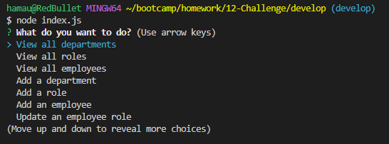

# Employee Database Tracker

## Description

This project was made with the intention of practicing and developing my SQL skills. It's a content management system for companies that store and manage departments, roles, and employee information. It will store an employee's name, their manager and their role which will include the salary of that role and what department it belongs to. 

## Installation

## Usage

## License

N/A