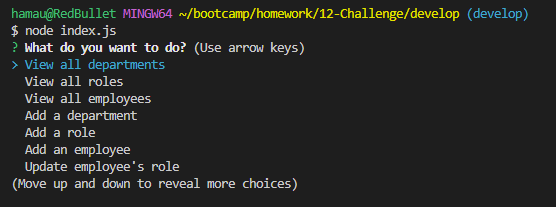
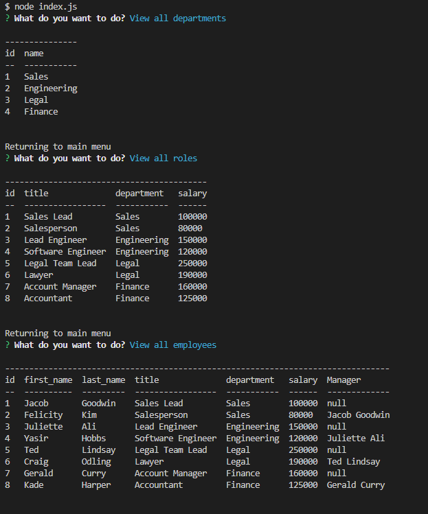

# Employee Database Tracker

## Description

This project was made with the intention of practicing and developing my SQL skills. It's a content management system for companies that store and manage departments, roles, and employee information. It will store an employee's name, their manager and their role which will include the salary of that role and what department it belongs to. 

## Installation

- Have Nodejs installed (I used v16.18)
- Install npm dependencies
    - use 'npm install' on terminal once navigated to folder
- Have mysql installed
    - run the schema.sql file with your mysql shell
    - run the seeds.sql file if you wish to populate the database

## Usage

Navigate to folder where index.js is located in your terminal then run the file using node, "node index.js" or use "npm start". You'll be presented a prompt in your terminal asking you to select an option provided, you can navigate using the 'arrow keys' and 'enter' to select. The 'View all..." will show you the data stored in your database which was placed in through the "Add..." option or through the seeds.sql file. It is formatted for easier reading. You can also delete data from the database but if you delete a department or role then all roles and employees under them will be deleted as well. You can update an employee's role/department before doing so through one of the options given at the main menu. Please see the [video demonstration](https://drive.google.com/file/d/1lk4-8Dy_WpzeIoDZYEtJ2JHeDUGySKae/view) for it in practice. Below are example images of the terminal and the resulting website.

## License

N/A